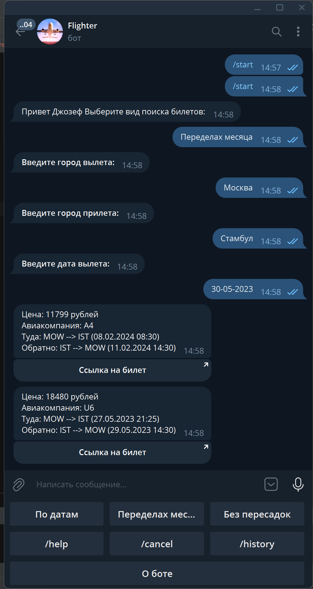

# Flighter (telegram bot)
#### Один все написал
#### Для поиска авиабилетов через сервер Aviasales.ru

-   ###  ***Для разработчиков*** 

[Ссылка на бот](https://t.me/check_fly_bot)

## Requirements

* Python 3.7+
* [pyTelegramBotAPI](https://github.com/python-telegram-bot/python-telegram-bot) – Python Telegram Bot API
* [requests](https://github.com/psf/requests) - библиотека requests
* [python-dotenv](https://github.com/theskumar/python-dotenv) - для безопасности учетных данных
* [sqlite3](https://github.com/sqlite/sqlite) - для создания база данных пользователи и их взаимодействие с ботом
Вы можете установить все зависимости, выполнив следующую команду: `pip install -r requirements.txt`

## Команды бота

* `/start` - запуск бота, выполняется автоматически при подключении к боту.
* `/help` - список команд и их описание.
* `/cancel` - Отмена поиска.
* `/search_low_price` - Поиск дешёвые билеты.
* `/search_month` - поиск билеты в течение месяца.
* `/search_non_stop_tickets` - поиск самых дешевых билетов без пересадок.
* `/history` - узнать историю поиска билетов.

## Как работать с ботом 
В файле .env.template вписать `BOT_TOKEN = "Ваш токен для бота, полученный от @BotFather"`
и `API_KEY = "Ваш ключ полученный от API "`
После переименовать файл в .env
Для запуска бота выполнить в терминале команду `python3 main.py`
Список всех команд, поддерживаемых ботом, можно посмотреть по команде `/help`

-   ###  ***Для пользователей*** 
### Вывод результата

После нажатия кнопки выбора вида поиска введите город отравления и зе тем город прибывания затем дата отправления

Пример результата:

